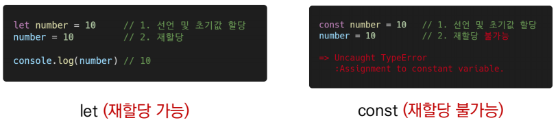
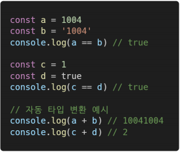

# JavaScript가 뭘까?

> JavaScript는 웹 페이지에서 복잡한 기능을 구현할 수 있도록 하는 스크립팅 언어 또는 프로그래밍 언어입니다.

- [HTML](https://developer.mozilla.org/ko/docs/Glossary/HTML)은 웹 콘텐츠의 구조를 짜고 의미를 부여하는 마크업 언어입니다. 예를 들어 페이지의 어디가 문단이고, 헤딩이고, 데이터 표와 외부 이미지/비디오인지 정의합니다.
- [CSS](https://developer.mozilla.org/ko/docs/Glossary/CSS)는 HTML 콘텐츠에 스타일을 적용할 수 있는 스타일 규칙 언어입니다. 배경색을 추가하고, 글꼴을 바꾸고, 콘텐츠를 신문처럼 다열 레이아웃으로 배치할 수 있습니다.
- [JavaScript](https://developer.mozilla.org/ko/docs/Glossary/JavaScript)는 동적으로 콘텐츠를 바꾸고, 멀티미디어를 제어하고, 애니메이션을 추가하는 등 거의 모든 것을 만들 수 있는 스크립팅 언어입니다. (정말 모든게 가능하지는 않겠지만, JavaScript 코드 몇 줄만으로도 놀라운 결과를 이룰 수 있습니다)

## Javascript로 가능 한 작업

- 변수에 값을 저장할 수 있습니다. 바로 위의 예제를 보면, 요청해서 받은 새로운 이름을 `name`이라는 변수에 저장합니다.
- 프로그래밍에서 "문자열"(string)이라고 부르는, 텍스트 조각을 조작합니다. 위 예제에서는 문자열 "플레이어 1: "과 `name` 변수의 값을 합쳐 온전한 텍스트 레이블("Player 1: Chris")을 생성합니다.
- 웹 페이지에서 발생하는 어떤 이벤트에 코드가 응답하도록 합니다. 예제에서는 `click` 이벤트를 사용해서 레이블을 클릭하는 순간을 탐지하고, 그 후에 텍스트 레이블을 업데이트하고 있습니다.

## JavaScript 실행 순서

> 브라우저가 JavaScript 블록을 마주치면, 일반적으로는 순서대로 위에서 아래로 실행합니다. 따라서 코드 배치 순서에도 주의를 기울여야 합니다. 예를 들기 위해 맨 위의 첫 예제 코드로 돌아가봅시다.

```javascript
const para = document.querySelector('p');

para.addEventListener('click', updateName);

function updateName() {
  const name = prompt('Enter a new name');
  para.textContent = `Player 1: ${name}`;
}
```

- 위 코드는 텍스트 문단을 선택(1번 줄)해서 이벤트 수신기를 부착(3번 줄)하여, 사용자가 문단을 클릭하면 `updateName()` 코드 블록(5번 ~ 8번 줄)을 실행하도록 합니다. `updateName()` 코드 블록(이렇게 재사용 가능하도록 나눠놓은 코드 블록을 "함수"라고 합니다)은 사용자에게 새로운 이름을 물어보고, 그 이름을 문단에 삽입해서 화면을 업데이트합니다.

  만약 1번 줄의 코드와 3번 줄의 코드 순서를 서로 바꿔서 실행했으면 원하는 동작 대신 [브라우저 개발자 콘솔 (en-US)](https://developer.mozilla.org/en-US/docs/Learn/Common_questions/What_are_browser_developer_tools)에 오류, `TypeError: para is undefined`가 나타나며, `para` 객체가 아직 존재하지 않으므로 이벤트 수신기를 부착할 수도 없다는 뜻입니다.

## 외부 JavaScript 관리

- HTML 작성 페이지 내부에서 작성하는 JavaScript말고 외부 파일로 별도 관리 할 수 있다.

  1. HTML 파일과 같은 폴더에 새로운 파일을 만드세요. `script.js`라는 이름을 붙여줍니다. 확장자를 .js로 지정했는지 다시 확인하세요. JavaScript 파일을 인식하는 방법입니다.

  2. 현재 \<script>요소를 다음 코드로 대체하세요

     ```javascript
     <script src="script.js" defer></script>
     ```

  3.  `script.js` 파일 안에 아래 내용을 입력하세요.

     ```javascript
     function createParagraph() {
       const para = document.createElement('p');
       para.textContent = 'You clicked the button!';
       document.body.appendChild(para);
     }
     
     const buttons = document.querySelectorAll('button');
     
     for (const button of buttons) {
       button.addEventListener('click', createParagraph);
     }
     ```

  4. 저장하고 브라우저를 새로고침하세요. 아까와 같은 모습을 볼 수 있습니다! 분명히 동작은 같지만, JavaScript 파일을 외부 파일로 분리할 수 있었습니다. 보통은, 코드도 정리하고 여러 HTML 파일에서 같은 코드를 재사용할 수 있도록, 스크립트를 외부 파일로 분리하는 것이 좋습니다.


# JavaScript 문법, 자료형

## 기본 문법

>JavaScript는 문법의 대부분을 Java와 C, C++로부터 차용하고 있으며, Awk, Perl, Python의 영향도 받았습니다.

> JavaScript는 **대소문자를 구별**하며 **유니코드** 문자셋을 이용합니다. 예를 들면, Früh(독일어로 "이른")을 변수명으로 사용할 수도 있습니다.

- 명령문이 한 줄을 다 차지할 경우에는 세미콜론이 필요하지 않습니다. 그러나 한 줄에 두 개 이상의 명령문이 필요하다면 반드시 세미콜론으로 구분해야 합니다.
  - 세미콜론이 필요하지 않은 경우라도 항상 세미콜론으로 끝마치는 편이 버그 예방 차원에서 더 좋은 습관이라고 여겨집니다.

### 주석

> **주석**의 구문은 C++ 및 다른 많은 언어와 똑같습니다.

```javascript
// 한 줄 주석

/* 이건 더 긴,
 * 여러 줄 주석입니다.
 */

/* 그러나, /* 중첩된 주석은 쓸 수 없습니다 */ SyntaxError */
```

## 변수와 식별자

- 식별자(identifier)는 변수를 구분할 수 있는 변수명을 말함
-  식별자는 반드시 문자, 달러($) 또는 밑줄(_)로 시작
- 대소문자를 구분하며, 클래스명 외에는 모두 소문자로 시작
-  예약어* 사용 불가능
  - 예약어 예시: for, if, function 등

### 선언

- const : 블록 스코프 읽기 전용 상수를 선언
  - 한번 선언하면 값을 수정 할 수 없다
- let : 블록 스코프 지역 변수를 선언, 추가로 동시에 값을 초기화
  - 값을 수정 할 수 있다
- var : 변수를 선언, 추가로 동시에 값을 초기화


​	**변수** : 애플리케이션에서 값에 상징적인 이름으로 변수를 사용합니다. 
​			  변수명은 [식별자(identifiers)](https://developer.mozilla.org/ko/docs/Glossary/Identifier)라고 불리며 특정 규칙을 따릅니다.

**let, const**




- 블록 스코프* (bolck Scope)
  - if, for, 함수 등의 중괄호 내부를 가리킴
  - 블록 스코프를 가지는 변수는 블록 바깥에서 접근 불가능


**var**

- var로 선언한 변수는 재선언 & 재할당 모두 가능


- ES6 이전에 변수를 선언할때 사용되던 키워드
- 호이스팅되는 특성으로 인해 예기치 못한 문제를 발생
  - ES6부터는 var 대신 const, let를 사용하는 것을 권장
- 함수 스코프 (function scope)
  - 함수의 중괄호 내부를 가리킴
  - 함수 스코프를 가지는 변수는 함수 바깥에서 접근 불가능


**호이스팅**

- 호이스팅(hoisting)
  - 변수를 선언 이전에 참조할 수 있는 현상
  - 변수 선언 이전의 위치에서 접근 시 undefined를 반환
- 자바스크립트는 모든 선얼을 호이스팅한다.
- 즉, var, let, const모두 호이스팅이 발생하지만, var는 선언과 초기화가 동시에 발생하여
  일지석 사각지대가 존대하지 않는다.

## 데이터 구조

> 최신 EXMAScript 표준은 8가지 데이터 형태로 정의 합니다.

- 크게 원시타입(Primitive type)과 참조 타입(Reference type)으로 분류죔


- 8가지 기본 데이터 형
  1. Boolean : True 와 false
  2. null : null 값을 나타내는 특별한 키워드(JavaScript는 대소문자를 구분하므로, null과 Null,NULL 혹은 다른 변형과도 다릅니다.)
  3. undefined : 값이 정의되어 있지 않은 최상위 속성
  4. Number : 정수 또는 실수형 숫자(ex. 123 or 3.14159)
  5. Biglnt : 임의 정밀도의 정수 ex. 9007199254740992n
  6. String : 문자열
  7. Symbol : (ECMAScript 2015에 도입) 인스턴스가 고유하고 불변인 데이터 유형
  8. Object
- 원시타입
  - 객체(object)가 아닌 기본 타입
  - 변수에 해당 타입의 값이 담김
  - 다른 변수에 복사할 때 실제 값이 복사됨


- 참조 타입
  - 객체(object) 타입의 자료형
  - 변수에 해당 객체의 참조 값이 담김
  - 다른 변수에 복하 할 때 참조 값이 복사 됨


### 자료형 변환

- 숫자과 '+' 연산자

```javascript
x = 'The answer is ' + 42 // "The answer is 42"
y = 42 + ' is the answer' // "42 is the answer"
```

### 문자열을 숫자로 변환하기

> 숫자를 나타내는 값이 문자열로 메모리에 있는 경우, 변환을 위한 메서드가 있습니다.

- parselnt() : 정수로만 반환, 소수에는 사용성이 떨어진다
- parseFloat()

## 연산자

### 할당 연산자

- 오른쪽에 있는 피연산자의 평가 결과를 왼쪽 피연산자에 할당하는 연산자
- 다양한 연산에 대한 단축 연산자 지원
- (참고) Increment 및 Decrement 연산자
  - Increment(++): 피연산자의 값을 1 증가시키는 연산자
  - Decrement(--): 피연산자의 값을 1 감소시키는 연산자
  - Airbnb Style Guide에서는 ‘+=’ 또는 ‘-=’와 같이 더 분명한 표현으로 적을 것을 권장


### 비교 연산자

- 피연산자를 비교하고 결과값을 boolean으로 반환하는 연산자
- 문자열은 유니코드 값을 사용하며 표준 사전 순서를 기반으로 비교
  - ex>알바벳  끼리 비교할 경우
    - 알파벳 순서상 후순위가 더 크다
    - 소문다가 대문자보다 더 크다


### 동등 비교 연산자(==)

- 두 피연산자가 같은 값으로 평가되는지 비교 후 boolean 값을 반환
- 비교할 때 암묵적 타입 변환을 통해 타입을 일치시킨 후 같은 값인지 비교
- 두 피연산자가 모두 객체일 경우 메모리의 같은 객체를 바라보는지 판별
- 예상치 못한 결과가 발생할 수 있으므로 특별한 경우를 제외하고 사용하지 않음



### 일치 비교 연산자 (===)

- 두 피연사자가 같은 갑승로 평가되는지 비교 후 boolean 값을 반환
- 엄격한 비교가 이뤄지며 암묵적 타입 변환이 발생하지 않음
  - 엉격한 비교 : 두 비교 대상의 타입과 갑 모두 같은지 비교


### 논리 연산자

- 세 가지 논리 연산자로 구성
  - and 연산은 '&&' 연산자를 사용
  - or 연산은 '||(shift+\\)' 연산자를 이용
  - not 연산은 '!' 연산자를 이용
- 단축 평가 지원
  - ex) flase && true => false
  - true || false => true


### 삼항 연산자(Ternary Operator)

- 세 개의 피연산자를 사용하여 조건에 따라 값을 반환하는 연산자
- 가장 왼쪽의 조건식이 참이면 콜론(:) 앞의 값을 사용하고 그렇지 않으면 콜론(:) 뒤의 값 사용
- 삼항 연산자의 결과 갑이기 때문에 변수에 할당 가능
- (참고) 한줄에 표기하는 것을 권장


## 조건문

- 'if' statement
  - 조건 표현식의 결과갑을 Boolean 타입으로 변환 후 참/거직을 판단
- 'switch' statement
  - 조건 표현식의 결과값이 어느 값(case)에 해당하는지 판별
  - 주로 특정 변수의 값에 따라 조건을 분기할 때 활용
    - 조건이 많아질 경우 if문보다 가독성이 나을 수 있음

- if, else if, else
  - 조건은 소활고(condition) 안에 작성
  - 실행할 코드는 중괄호{} 안에 작성
  - 블록 스코프 생성


- swucth
  - 표현식(expression)의 결과값을 이용한 조건문
  - 표현식의 결과값과 case문의 오른쪽 값을 비교
  - break 및 defult문은 [선택적]으로 사용 가능
  - break문을 만나거나 default문을 실행 할 때 까지 다음 조건문 실행


## 반복문

### 종류와 특징

- while
  - 조건문이 참(true)인 동안 반복 시행
  - 조건은 소괄호 안에 작성
  - 실행할 코드는 중괄호 안에 작성
  - 블록 스코프 생성


- for
  - 세미콜론(;)으로 구분되는 세 부분 으로 구성
  - initialization
    - 최초 반복문 진입 시 1회만 실행되는 부분
  - condition
    - 매 반복 시행 전 평가되는 부분
  - expression
    - 매 반복 시행 이후 평가되는 부분
  - 블록 스코프 생성


- for ... in
  - 주로 객체(object)의 속성들을 순회할 때 사용
  - 배열도 순회 가능하지만 인덱스 순으로 순회한다는 보장이 없으므로 권장하지 않음
  - 객체의 속성(key)들을 순회 할때 사용
  - 배열도 순회 가능 하지만 권장하지 않음
  - 실행할 코드는 중괄호 안에 작성
  - 블록 스토프 생성


- for ... of
  - 반복 가능한(iterable)* 객체를 순회하며 값을 꺼낼 때 사용
    - 반복 가능한(iterable) 객체*의 종류: Array, Map, Set, String 등
  - 실행할 코드는 중괄로 안에 작성
  - 블록 스코프 생성


## 함수

- 참조 타입 중 하나로써 function 타입에 속함
- JavaScript에서 함수를 정의하는 방법은 주로 2가지로 구분
  - 함수 선언식 (function declaration)
  - 함수 표현식 (function expression)
- JavaScript의 함수는 일급 객체*(First-class citizen)에 해당
  - 일급 객체*: 다음의 조건들을 만족하는 객체를 의미함
    - 변수에 할당 가능
    - 함수의 매개변수로 전달 가능
    - 함수의 반환 값으로 사용 가능

**함수의 정의**

- 함우싀 이름과 함께 정의 하는 방식
-  3가지 부분으로 구성
  - 함수의  이름(name)
  - 매개변수 (args)
  - 함수 body(중괄호 내부)

### 함수 표현식(function expression)

- 함수를 표현식* 내에서 정의하는 방식
  - 표현식*: 어떤 하나의 값으로 결정되는 코드의 단위
- 함수의 이름을 생략하고 익명 함수*로 정의 가능
  - 익명 함수*(anonymous function): 이름이 없는 함수
  - 익명 함수는 함수 표현식에서만 가능
- 3가지 부분으로 구성
  - 함수의 이름 (생략 가능) 
  - 매개변수 (args)
  - 몸통 (중괄호 내부)

**매개변수와 인자의 개수 불일치 허용**

- 매개변수보다 인자의 개수가 많은 경우


- 매개변수보다 인자긔 개수가 적을 경우


- rest parameter(...)를 사용하면 함수가 정해지지 않은 수의 매개변수를 배열로 받음
  - 만약 rest parameter로 처리한 매개변수에 인자가 넘어오지 않을 경우에는, 빈 배열로 처리


- spread operator(...)를 사용 하면 배열인자를 전개하여 전달 가능


