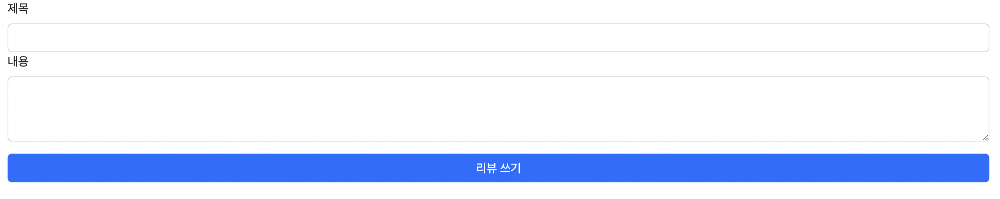
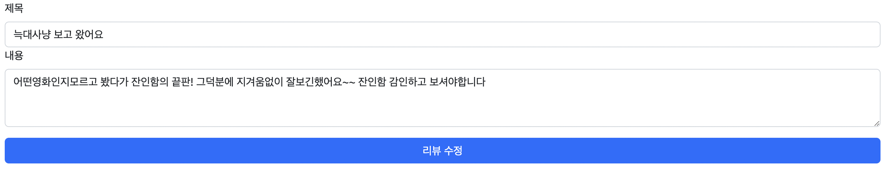

# Pair Project - 2인

# CRUD

<aside>
📚 페어프로그래밍 진행 후 **가상환경 폴더를 제외한** 파일 및 폴더를 압축해서 실라버스에 제출해주세요.
가상환경을 포함해서 제출하면 용량 제한을 초과하니 꼭 가상환경 폴더를 제외하고 압축해서 제출해주세요.

</aside>

## 목표

두 사람이 팀을 이뤄서 영화 리뷰 커뮤니티 서비스의 CRUD 기능과 페이지를 구현합니다.

## 요구 사항

### 모델 Model

모델은 아래 조건을 만족해야합니다. 

기능 추가를 위한 필드를 추가해도 됩니다.

- 모델 이름 : Review

- 모델 필드

  | 이름       | 역할           | 필드     | 속성              |
  | ---------- | -------------- | -------- | ----------------- |
  | title      | 리뷰 제목      | Char     | max_length=80     |
  | content    | 리뷰 내용      | Text     |                   |
  | created_at | 할 일 생성시간 | DateTime | auto_now_add=True |
  | updated_at | 할 일 수정시간 | DateTime | auto_now = True   |
  |            |                |          |                   |

### 기능 View

아래 작성된 기능을 구현합니다.

- 리뷰 목록 보기
- 리뷰 내용 보기
- 리뷰 작성 하기
- 리뷰 수정하기
- 리뷰 삭제하기

### 화면 Template

아래 작성된 페이지와 컴포넌트를 구현해야 합니다.

- 리뷰 목록 페이지 index

  - 리뷰 ID / 리뷰 제목 / 리뷰 작성 시간

    - 리뷰 제목 클릭 시 해당 리뷰의 detail 페이지로 이동

  - 작성 버튼

    

    - 버튼 클릭 시 new 페이지로 이동

- 리뷰 보기 페이지 detail

  - 리뷰 제목 / 리뷰 내용 / 리뷰 작성 시간
  - 수정 버튼
    - 버튼 클릭 시 edit 페이지로 이동
  - 삭제 버튼
    - 버튼 클릭 시 리뷰 삭제 delete

  

- 리뷰 작성 페이지 new

  - 리뷰 제목 / 리뷰 내용
  - 생성 버튼
    - 버튼 클릭 시 새로운 리뷰 생성 create

  

- 리뷰 수정 페이지 edit

  - 작성 폼에 원본 리뷰의 제목 과 내용이 작성된 상태.
  - 수정 버튼
    - 버튼 클릭 시 해당 리뷰 데이터 수정 update

  
