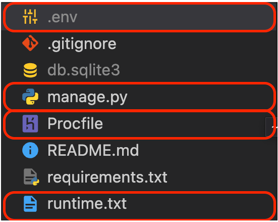
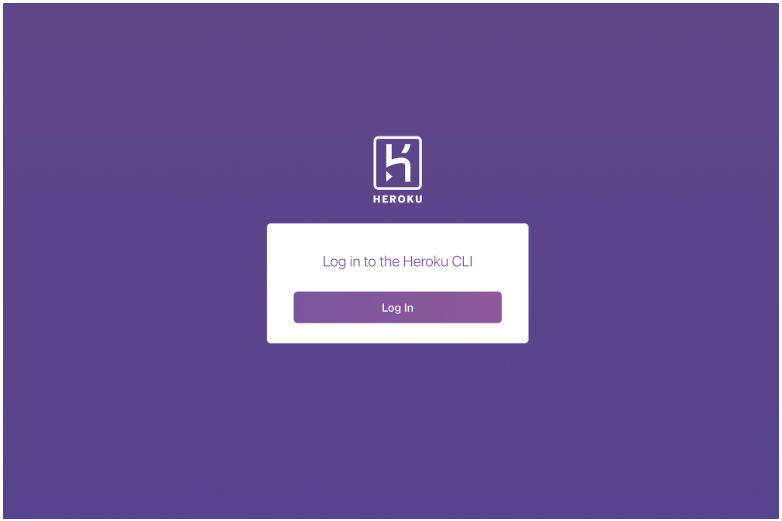
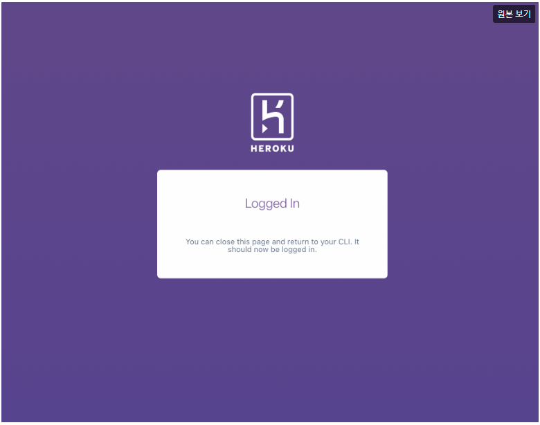

# 헤로쿠(Heroku)


<aside> 💡 아래 가이드 내용은 https://devcenter.heroku.com/categories/working-with-django 에서 확인할 수 있습니다.
</aside>


## Git

<aside> ❗ 헤로쿠는 기본적으로 git을 활용해서 배포를 합니다. 다만, 이 가이드에서는 git에 대한 설명을 하지 않습니다.
## Heroku 설치 & 로그인

### 1. Heroku CLI 설치

아래 사이트에서 OS에 맞게 설치

[The Heroku CLI](https://devcenter.heroku.com/articles/heroku-cli)

### 2. [터미널] Heroku 설치 확인

```bash
heroku --version

# 아래 메세지가 출력되면 정상
# heroku/7.65.0 darwin-x64 node-v14.19.0
```

## 배포 준비

### 1. [터미널] 패키지 설치

<aside> ⚠️ 가상 환경이 실행된 상태인지 확인합니다.
```bash
pip install gunicorn 
pip install dj-database-url # PostgreSQL 설정용 패키지
pip install psycopg2-binary # PostgreSQL 설정용 패키지
pip install whitenoise # 정적 파일 처리용 패키지
pip install python-dotenv # 환경 변수 관리 패키지

pip freeze > requirements.txt # 패키지 목록 저장
```

### 2. [Procfile] Procfile

<aside> ❓ Procfile 헤로쿠가 배포 과정에 실행할 명령어 모음 파일
<aside> 🧑‍💻 [manage.py](http://manage.py) 가 있는 폴더에 **`Procfile`**(대소문자 구분) 생성하고 아래 명령어 작성 프로젝트명 → django-admin startproject `[프로젝트명]`


프로젝트명 작성

```
web: gunicorn [프로젝트명].wsgi --log-file -
```

예시

```
web: gunicorn pjt.wsgi --log-file -
```

### 3. [runtime.txt] runtime.txt 생성

<aside> ❓ runtime.txt 헤로쿠가 사용해야할 파이썬 버전 명시
<aside> 🧑‍💻 [manage.py](http://manage.py) 가 있는 폴더에 **`runtime.txt`** 생성 후 버전 작성


파이썬 버전 작성

```
python-3.9.15
```

### 4. [[settings.py](http://settings.py)] 데이터베이스 PostgreSQL 설정

```html
❓ PostgreSQL 관계형 데이터베이스 중 하나로 헤로쿠에서 기본적으로 지원하는 데이터베이스 헤로쿠에서는 SQLite를 사용할 수 없기 때문에 추가 설정이 필요합니다.
```

```html
🧑‍💻 [[settings.py](http://settings.py)] DATABASES 아래에 코드를 추가합니다.

```


```python
DATABASES = {
    "default": {
        "ENGINE": "django.db.backends.sqlite3",
        "NAME": BASE_DIR / "db.sqlite3",
    }
}

"""
기존 DATABASES 코드 아래에 아래 세 줄을 추가합니다.
"""
import dj_database_url

db_from_env = dj_database_url.config(conn_max_age=500)
DATABASES["default"].update(db_from_env)
```

### 5. [.env / [settings.py](http://settings.py)] SECRET_KEY 분리

```html
❓ SECRET_KEY Django 인증(회원가입, 로그인 등등) 과정에 필요한 외부로 노출되면 안되는 비밀키입니다.
```


<aside> ❓ SECRET_KEY Django 인증(회원가입, 로그인 등등) 과정에 필요한 외부로 노출되면 안되는 비밀키입니다.
```html
 🧑‍💻 [Djecrety.ir](http://Djecrety.ir) 에서 새로운 SECRET_KEY를 생성해서 사용합니다. manage.py가 있는 폴더에`.env` 파일을 생성합니다.

[.env] 생성한 SECRET_KEY를 작성합니다.
```

[Djecrety](https://djecrety.ir/)

```
# .env
SECRET_KEY="생성한 SECRET_KEY"

# 예시
# SECRET_KEY="$o5(+um4@+4g#3pp_zj-+b3vx99qbecllpsr%wh-d&hk(d=he@"
```

<aside> ⚠️ .env 파일을 `.gitignore`에 추가합니다.


<aside> 🧑‍💻 [[settings.py](http://settings.py)] SECRET_KEY 코드를 수정합니다.


```python
"""
기존
SECRET_KEY = "..."
"""

# 수정
"""
아래 3줄은 파일 최상단에 작성합니다.
"""
from dotenv import load_dotenv
import os
load_dotenv() # .env 파일에서 환경 변수를 불러옵니다.

# 기존 SECRET_KEY 대신 사용합니다.
SECRET_KEY = os.getenv("SECRET_KEY")
```

### 6. [[settings.py](http://settings.py)] ALLOWED_HOSTS 설정

<aside> ❓ ALLOWED_HOSTS 서비스 접속을 허용할 도메인(주소) 목록입니다.


<aside> 🧑‍💻 [[settings.py](http://settings.py)] ALLOWED_HOSTS을 수정합니다.
```python
"""
# 기존
ALLOWED_HOSTS = []
또는
ALLOWED_HOSTS = ['*']
"""

# 수정
ALLOWED_HOSTS = ["127.0.0.1", "localhost", ".herokuapp.com"]
```

### 7. [[settings.py](http://settings.py) / .env] DEBUG 설정

<aside> ❓ DEBUG 오류가 발생했을 때 오류 원인 출력(노란 화면) 여부에 대해 결정하는 옵션입니다. 사용자에게 노출되면 안 되는 정보들이 많이 포함된 화면입니다. 그러므로 *배포 환경*에서는 DEBUG 옵션을 비활성화(*False*) 시킵니다.


<aside> 🧑‍💻 환경 변수를 통해 개발 환경(True)과 배포 환경(False)에서 다른 값이 할당되도록 하겠습니다. [[settings.py](http://settings.py)] DEBUG 값을 수정합니다.


```python
"""
# 기존 
DEBUG = True
"""

# 수정
# 환경 변수에서 가져온 DEBUG 값이
# (개발 환경) "True" 라면 DEBUG에 True 가 할당됩니다.
# (배포 환경) "False" 라면 DEBUG에 False 가 할당됩니다.
DEBUG = os.getenv("DEBUG") == "True"
```

<aside> 🧑‍💻 [.env] DEBUG 값을 추가합니다.


```
SECRET_KEY="..."

DEBUG="True"
```

### 8. [[settings.py](http://settings.py)] STATIC_ROOT 설정

<aside> ❓ STATIC_ROOT

배포 이전에는 Django가 각 앱의 static 폴더에서 정적 파일을 처리합니다. 하지만, 배포 이후에는 정적 파일에 대한 처리가 필요합니다. 정적 파일 처리를 위해 파일을 모아야 하는데(python [manage.py](http://manage.py) collectstatic) STATIC_ROOT에 할당된 경로에 파일이 모입니다.


<aside> 🧑‍💻 [[settings.py](http://settings.py)] STATIC_ROOT를 생성하고, 경로를 할당합니다.

</aside>

```python
"""
STATIC_URL = '/static/'
STATIC_URL 아래에 작성합니다.
"""

STATIC_ROOT = BASE_DIR / "staticfiles"
```

### 9. [[settings.py](http://settings.py)] whitenoise 설정

<aside> ❓ whitenoise 정적(static) 파일을 사용자에게 제공해주는 패키지입니다. DEBUG = False 일 때 장고는 정적 파일을 사용자에게 제공하지 않습니다. 정적 파일 제공을 whitenoise가 대신 담당 합니다.


<aside> 🧑‍💻 [[settings.py](http://settings.py)] MIDDLEWARE 리스트의 `SecurityMiddleware` 아래에 코드를 추가합니다. *SecurityMiddleware*는 기존에 작성 되어 있는 Middleware 입니다. *SecurityMiddleware*를 추가하지 않도록 합시다.


```python
MIDDLEWARE = [
		"""
		SecurityMiddleware는 추가하지 않습니다.
		SecurityMiddleware는 기존에 있는 코드입니다.
		"""
    "django.middleware.security.SecurityMiddleware",

		# SecurityMiddleware 아래에 다음 코드를 추가합니다.
    "whitenoise.middleware.WhiteNoiseMiddleware",

		# ... 이하 생략
]
```

### 확인사항

<aside> ⚠️ 생성한 파일들(Procfile, runtime.txt, .env)이 올바른 위치에 있는지 파일 이름이 정확한지 확인해주세요.
</aside>



<aside> ⚠️ .gitignore 에 .env / db.sqlite3 가 등록된 상태인지 확인해주세요.

</aside>

<aside> ⚠️ 패키지 목록을 저장 했는지 확인해주세요.
</aside>

## 배포

### 1. Heroku 로그인

1. [터미널] 명령어 입력

   ```bash
   heroku login
   ```

2. [터미널] 웹 로그인

   아래 상태에서 아무 키나 입력하면 로그인 페이지가 열립니다.

   

3. [브라우저] Log In 버튼 클릭

   

4. [브라우저] 로그인 완료 확인, 창 닫기

   

5. [터미널] 로그인 성공 메세지 확인

   

### 2. [터미널] Heroku 앱 생성

```bash
# 앱 이름을 정해서 랜덤으로 정해서 생성해줍니다.
heroku create
```

### 3. [터미널] 헤로쿠 환경(배포 환경)에서의 환경 변수(env) 등록

1. [브라우저] 헤로쿠 대쉬보드 접속

   [Heroku](https://dashboard.heroku.com/apps/)

2. [브라우저] 생성한 앱 대쉬보드 접속

3. [브라우저] Settings - Reveal Config Vars 클릭


d. DEBUG = False 입력 → Add 클릭 / SECRET_KEY = 생성한 SECRET_KEY 입력 → Add 클릭


### 

```bash
git add .

git commit -m "Commit Message"

# 로컬 master 브랜치 -> 헤로쿠 저장소 master 브랜치
git push heroku master
```

### 5. [터미널] 데이터베이스 설정

```bash
# 데이터베이스 마이그레이트
heroku run python manage.py migrate

# 관리자 계정 생성
heroku run python manage.py createsuperuser
```

### 6. [터미널] 웹사이트 열기

```bash
heroku open
```

## 재배포

<aside> 🧑‍💻 git add - commit - push heroku master를 합니다. makemigrations를 했다면 migrate를 합니다.

</aside>

## 에러 해결

<aside> ⚠️ 업로드한 이미지(Media)가 보이지 않아요.

</aside>

Heroku는 업로드한 파일을 저장을 해주지 않습니다.(무료 플랜)

파일 업로드는 AWS의 S3를 사용해서 처리해야 합니다.

<aside> ⚠️ 에러 메세지 Your account has reached its concurrent builds limit.

</aside>

```bash
# 터미널에 아래 명령어를 입력해서 헤로쿠를 재시작합니다.
heroku restart
```

<aside> ⚠️ 에러 메세지 You're using the staticfiles app without having set the STATIC_ROOT setting to a filesystem path

</aside>

`STATIC_ROOT`를 확인해주세요.

<aside> ⚠️ 정적(static) 파일 출력이 안되요.

</aside>

`whitenoise` 를 확인해주세요.

<aside> ⚠️ 에러 메세지

raise KeyError(key) from None KeyError: '…'

</aside>

헤로쿠 환경 변수`SECRET_KEY` 를 확인해주세요.

<aside> ⚠️ 에러 화면

</aside>


`ALLOWED_HOSTS`를 확인해주세요.